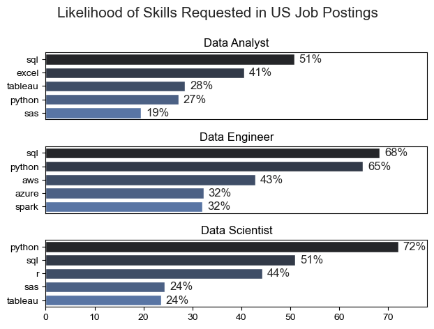
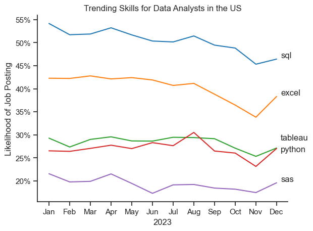
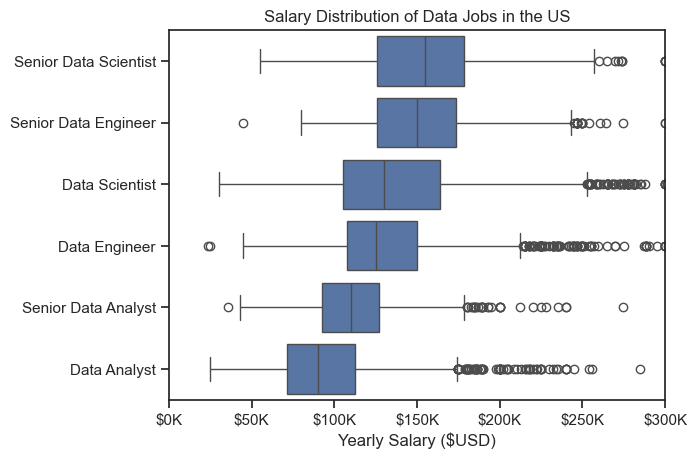
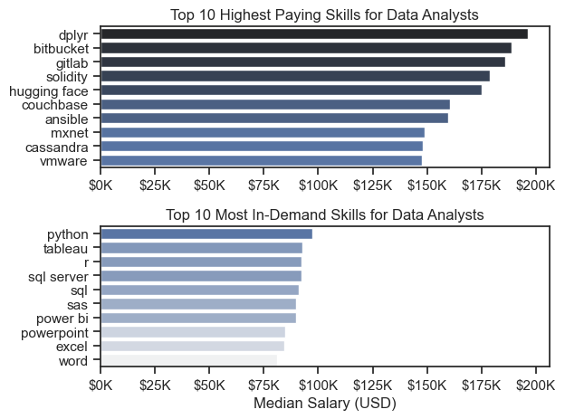
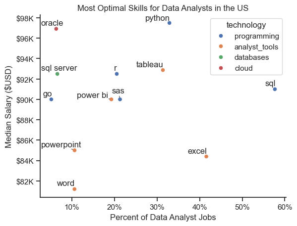

# Introduction

Welcome to my analysis of the data job market, focusing on data analyst roles. This project was created out of a desire to navigate and understand the job market more effectively. It delves into the most in-demand and top-paying skills to help find optimal job opportunities for data analysts.

# The Questions
Below are the questions I want to answer in my project:

1. What are the skills most in demand for the top 3 popular data roles?
2. How are in-demand skills trending for Data Analysts?
3. How well do jobs and skills pay for Data Analysts?
4. What are the optimal skills for data analysts to learn? (High Demand + High Paying)

# Data Preparation and Cleanup

I imported the  necessary libraries and loaded the dataset, followed by initial data cleaning tasks to ensure data quality. I ran the code below in all my notebooks.

```python
# Importing Libraries
import ast
import pandas as pd
import seaborn as sns
from datasets import load_dataset
import matplotlib.pyplot as plt  

# Loading Data
dataset = load_dataset('lukebarousse/data_jobs')
df = dataset['train'].to_pandas()

# Data Cleanup
df['job_posted_date'] = pd.to_datetime(df['job_posted_date'])
df['job_skills'] = df['job_skills'].apply(lambda x: ast.literal_eval(x) if pd.notna(x) else x)
```
# The Analysis

## 1. What are the most demanded skills for the top 3 popular data roles?

I filtered out the different data roles to find the three most popular ones, then I got the top 5 skills for each of these roles. The query below can tell me what skills to focus on depending on what role I'm targeting.

Notebook: [2_Skill_Demand.ipynb](3_Project/2_Skill_Demand.ipynb)

### Visualize Data

```python
fig, ax = plt.subplots(len(job_titles), 1)

for i, job_title in enumerate(job_titles):
    df_plot = df_skills_perc[df_skills_perc['job_title_short'] == job_title].head(5)
    sns.barplot(data=df_plot, x='skill_percent', y='job_skills', ax=ax[i], hue='job_skills', palette='dark:b', legend=False)
    
plt.show()

```
### Results



### Insights

- Python is a very versitile tool, highly demanded by all three roles, but mostly for Data Scientists at **72%**.

- SQL is the most requested skill for both Data Analysts and Data Engineers, appearing in **51%** and **68%** of job postings, respectively. While Python dominates Data Scientist roles, SQL is also widely required, featuring in **51%** of Data Scientist job postings.

- Data Engineers require more specialized technical skills (AWS, Azure, Spark) compared to Data Analysts and Data Scientists who are expected to be proficient in more general data management and analysis tools (Excel, Tableau).

## 2. How are in-demand skills trending for data analysts?

To analyze the trends in data analyst skills for 2023, I first filtered the dataset to include only data analyst roles. Next, I calculated the number of job postings for each skill, grouped by the month they were posted. Finally, I visualized the data, highlighting the top five most in-demand skills.

### Visualize Data

```python
from matplotlib.ticker import PercentFormatter

df_plot = df_DA_US_percent.iloc[:, :5]
sns.lineplot(data=df_plot, dashes=False, palette="tab10")
ax = plt.gca()
ax.yaxis.set_major_formatter(PercentFormatter(decimals=0))

plt.show()
```
### Results



### Insights

- SQL and Excel remain foundational skills for data analysts in the US, with SQL maintaining a demand of **50-55%** for most of the year. Excel holds steady at around **40-45**, but experiences a drop towards the end of the year, falling to about **35%** in November.

- Python and Tableau have similar demand levels, fluctuating between **25-30%** throughout the year. Both skills show consistent demand, indicating that they remain important, though not as dominant as SQL or Excel.

- SAS is consistently the least demanded skill in this group, with its likelihood of appearing in job postings being below **20%** for most of the year.

 ## 3. How well do jobs and skills pay for Data Analysts?

 ### Salary Analysis for Data Jobs

 To identify the highest-paying jobs and skills in the data field, I analyzed the median salaries for various data roles in the US. I selected the top six positions based on salary and visualized their salary distributions using a box plot for clearer comparison.

 #### Visualize Data

 ```python
 # Box Plot
sns.boxplot(data=df_US_top4, x='salary_year_avg', y='job_title_short', order=job_order)
ax.xaxis.set_major_formatter(plt.FuncFormatter(lambda x, _: f'${int(x/1000)}K'))
plt.show()

# Histogram
 salaries = df_US_top4.loc[df_UK_top4['job_title_short'] == 'Senior Data Scientist']['salary_year_avg']
ax.xaxis.set_major_formatter(plt.FuncFormatter(lambda x, _: f'${int(x/1000)}K'))
plt.show()
```
### Results


*Box plot visualizing the salary distributions for the top 4 data jobs in the US.*

### Insights

- There is a noticeable disparity in salary ranges across different job positions. Senior Data Scientist roles, which offers a median salary of about **$150K**, reflect the high demand for advanced data expertise and industry experience.

- Data Analyst roles have the lowest salary range, with a median salary of approximately $75K. This position typically has a smaller variation in salary compared to more senior roles, suggesting less room for salary negotiation or differences in compensation across industries for this entry-level role. 

- As job seniority and specialization increase, so do median salaries. Senior roles like Senior Data Scientist and Senior Data Engineer not only command higher median salaries but also display greater variation in pay, highlighting the widening salary range as responsibilities grow.

### Highest Paid and Most Demanded Skills for Data Analysts

Next, I narrowed my analysis and focused only on data analyst roles. I looked at the highest-paid skills and the most in-demand skills. I used two bar charts to showcase these.

### Visualize Data

```python
sns.barplot(data=df_top_pay, x='median', y=df_top_pay.index, ax=ax[0], hue='median', palette='dark:b_r', legend=False)

sns.barplot(data=df_top_skills, x='median', y=df_top_skills.index, ax=ax[1], hue='median', palette='light:b', legend=False)

plt.show()
```
### Results


*These bar graphs compare the top 10 highest paying skills with the top 10 most in-demand skills for data analysts based on median salary (USD).*

### Insights

- The top-paying skills like `dplyr`, `Bitbucket`, and `Gitlab` suggest that proficiency in advanced data manipulation, version control, and collaboration tools can lead to significantly higher earnings for data analysts, showing the financial benefits of mastering technical tools that enhance workflow efficiency.

- The second graph shows that while foundational skills such as `Python`, `SQL`, and `R` are more in-demand, they don't command the highest salaries, indicating that while these skills are necessary for most data analyst roles, they aren't as lucrative as more specialized or niche skills.

- The lower-paying, high-demand skills like `PowerPoint` and `Word` in the second graph indicate that while basic business tools are essential for many data analyst roles, they offer little salary differentiation, suggesting that mastering technical skills is key to increasing earning potential.

## 4. What are the optimal skills for data analysts to learn? (High Demand + High Paying)

To determine which skills were both the highest-paying and most in-demand, I calculated the median salary for each skill and the frequency of its appearance in job postings. I then visualized the results with a scatter plot, using different colors to represent various technology categories for clearer differentiation.

#### Visualize data

```python
sns.scatterplot(data=df_plot, x='skill_percent', y='median_salary', hue='technology')

ax.yaxis.set_major_formatter(plt.FuncFormatter(lambda y, pos: f'${int(y/1000)}K')) 
ax.xaxis.set_major_formatter(PercentFormatter(decimals=0))

plt.show()
```

### Results



### Insights

- `Oracle` appears to have the highest median salary of around **$97K**, despite being less common in job postings. This suggests a high value placed on specialized database skills within the data analyst profession.

- More commonly required skills like `Excel` and `SQL` have a large presence in job listings but lower median salaries compared to specialized skills like `Python` and `Tableau`, which not only have higher salaries but are also moderately prevalent in job listings.

- Skills such as `Python`, `Tableau`, and `R` are towards the higher end of the salary spectrum while also being fairly common in job listings, indicating that proficiency in these tools can lead to good opportunities in data analytics.


